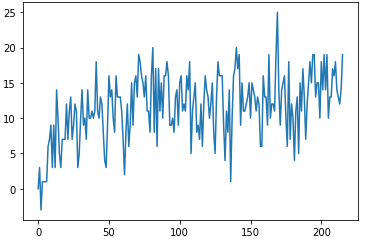
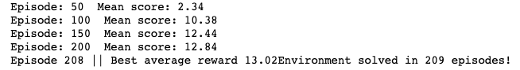

## Project 1: Navigation

#### Reinforcement Learning algorithm

The solution uses a deep reinforcement learning agent to solve the environment. It utilizes the following modifications to the basic [DQN algorithm](http://files.davidqiu.com//research/nature14236.pdf):

- [Double DQN](https://arxiv.org/abs/1509.06461)
- [Dueling DQN](https://arxiv.org/abs/1511.06581)
- [Prioritized Experience Replay](https://arxiv.org/abs/1511.05952)

The algorithm is based on the RL framework provided by the nanodegree during the moon lander exercise.

**DQN**

Based on the original DQN setup, the agent uses a separate target network, and replays its experiences to learn from. During a learning step, it uses a sample from the experience buffer to adjust the local network's weights. The target network is updated in every learning step using a soft max update and the local network's weights.

**Double DQN**

In DQN, we evaluate a possible next state's value according to its maximum state-action values. However, as observed maximum values tend to be higher than the true maximum values, these expectations are too optimistic. In order to deal with this issue, the Double DQN uses different networks for finding and evaluating the maximum values. The index of the maximum is obtained from the local network, and the maximum value is from the target.

**Dueling DQN**

In many cases, a state's value is almost independent from the action taken there. The dueling DQN alters the underlying neural network in order to separate the state value and the advantage values. The advantage values are the additional values gained from the actions taken there. By this separation, the Q values get more stable.

**Prioritized Experience Replay**

By using random sampling, we tend to work partly from cases which are already well learned. Prioritizing experiences means that we focus on experiences where our agent took mistakes. By doing this, the learning gets more efficient. The experiences are prioritized based on their absolute errors (experiences with larger error are selected more often).

#### Neural network

The network I used was fairly simple. It had three hidden layers, each of them with 128 neurons, and a dueling layer on the top of it. In order to control for overfitting, the first layer is followed by a 25% dropout layer. After the third layer, the dueling layers have 1 (state value) and 37 (advantage layer) neurons. The mean is subtracted from the advantage layer, and the output is the advantage layer plus the state value. The activation functions after the first three layers are Relu, and the optimizer is Adam.

#### Hyperparameters

I haven't really done any hyperparameter tuning, as the training is pretty slow. I used the following hyperparameters:

- epsilon: 1 / episode
- buffer size: 100,000
- gamma: 0.99
- tau (soft update parameter): 0.05
- learning rate: 0.0005
- learning is performed in every 4 steps
- 0.005 is added to each error when turning them into weights

## Results

With the described agent, I was able to solve the environment in 208 episodes (the same setup run twice, and resulted in 208 and 215 episodes).

The average reward gets to 10+ fairly quickly, usually after the 50th episode, but after it, the learning starts to slow down. As I have experienced during the runs, the result of the first 50 episodes are not really relevant, I had runs with very similar final results, where the agent had an average reward of 2.5 in the first 50 episodes.

Without prioritized replay, the agent solved the environment in around 250 episodes. However, the prioritized replay slowed down the training process, so in the end of the day the random buffer took less time to finish.

## Next steps

As I see, the main problem with my agent is its speed. It took around 30 minutes to solve the environment, and this slowness makes it really unpractical to experiment with different setups. So, at first, I would try to come up with a faster implementation of the prioritized buffer. If it is faster, I would do some hyperparameter tuning, including the tuning of network parameters.
